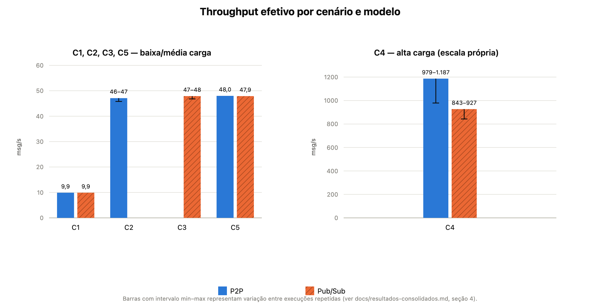
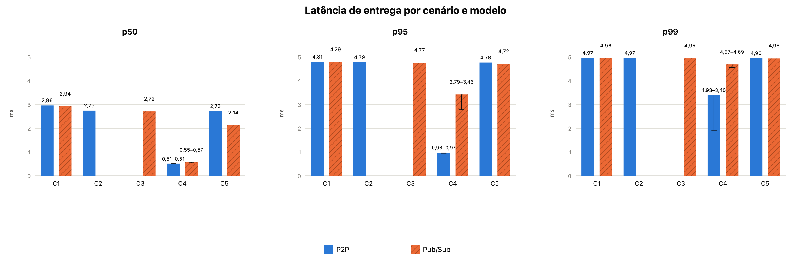
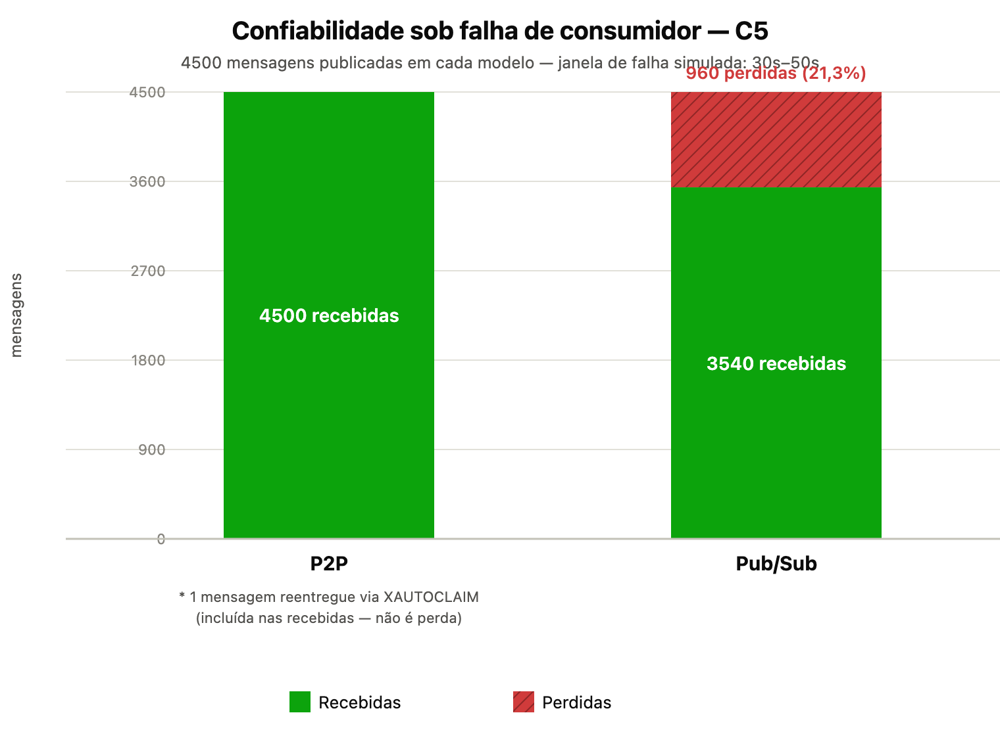

# Resultados Consolidados — C1–C5

## 1. Visão Geral

Os cinco cenários experimentais (C1–C5) estão **implementados e validados**, conforme documentado no [`README.md`](../README.md) principal e nos registros locais em `docs/implementation-log/` (Semanas 12–16).

Este documento consolida, em um único lugar, os resultados já observados e documentados nessas fontes, para servir de base direta à seção de Resultados da monografia. Ele **não inventa nem estima** nenhum valor que não esteja registrado em alguma dessas fontes.

Estado da consolidação, por categoria:

- **Throughput e confiabilidade** (enviadas, recebidas, perda, `lost`, `redelivered`): **consolidados** — todos os cinco cenários têm números exatos documentados.
- **Tempo decorrido e throughput real**: **consolidados**, mas com variação observada entre execuções repetidas em alguns cenários (ver seção 4 e seção 7).
- **Percentis de latência (p50/p95/p99)**: **consolidados** — coletados em uma bateria automatizada oficial (`experiments/scripts/collect-percentiles.js`) para todos os 5 cenários e seus modelos aplicáveis, incluindo as 2 execuções do C4. Ver seção 5.
- **CPU/memória**: confirmadas **fora do escopo final** do TCC (decisão já registrada em `docs/metricas.md`), não uma pendência de coleta.
- **`tcc_queue_depth`**: métrica implementada no código, mas **nunca exercitada** em nenhum cenário — nenhum valor existe para consolidar.

---

## 2. Cenários e Objetivos

| Cenário | Objetivo metodológico | Modelo(s) | Variável isolada |
|---|---|---|---|
| **C1 — Baseline** | Estabelecer linha de base de desempenho | P2P e Pub/Sub | Nenhuma (referência) |
| **C2 — Fila de Tarefas** | Avaliar balanceamento entre múltiplos workers | P2P | Múltiplos workers P2P (consumer group) |
| **C3 — Disseminação de Eventos** | Avaliar fidelidade de entrega em fan-out | Pub/Sub | Múltiplos subscribers (fan-out) |
| **C4 — Alta Carga** | Avaliar degradação sob taxa e volume altos | P2P e Pub/Sub | Alta taxa agregada + múltiplos producers/publishers |
| **C5 — Falha de Consumidor** | Avaliar resiliência/confiabilidade diante de falha | P2P e Pub/Sub | Falha temporária de um consumidor/subscriber |

---

## 3. Throughput e Confiabilidade

| Cenário | Modelo | Enviadas | Recebidas | Perda | Lost | Redelivered | Observação |
|---|---|---|---|---|---|---|---|
| Protótipo (Sem. 12) | P2P | 20 | 20 | 0% | — | — | Sanity-check, sem controle de taxa |
| Protótipo (Sem. 12) | Pub/Sub | 20 | 20 | 0% | — | — | Sanity-check, sem controle de taxa |
| C1 — Baseline | P2P | 600 | 600 | 0% | — | — | — |
| C1 — Baseline | Pub/Sub | 600 | 600 | 0% | — | — | — |
| C2 — Fila de Tarefas | P2P | 3000 | 3000 | 0% | — | — | 4 workers, distribuição 750×4 |
| C3 — Disseminação de Eventos | Pub/Sub | 3000 | 12000 (agregado) | n/a | — | — | Fan-out com 4 subscribers; perda agregada não se aplica (cada subscriber recebe 3000/3000) |
| C4 — Alta Carga | P2P | 120000 | 120000 | 0% | — | — | 2 producers, 4 workers |
| C4 — Alta Carga | Pub/Sub | 120000 | 120000 | 0% | — | — | 2 publishers, 1 subscriber |
| C5 — Falha de Consumidor | P2P | 4500 | 4500 | 0% | 0 | **1** | Recuperação via PEL/`XAUTOCLAIM` |
| C5 — Falha de Consumidor | Pub/Sub | 4500 | 3540 | 21,3% | **960** | 0 | Mensagens publicadas durante a desconexão foram perdidas; `received + lost = sent` (3540 + 960 = 4500) |

---

## 4. Tempo Decorrido e Throughput Real

Throughput real calculado como `enviadas ÷ tempo observado`. Para C3, o cálculo usa **enviadas** (publicação), não o recebido agregado, já que o `rate` do cenário é definido sobre a publicação, não sobre o fan-out de entrega.

| Cenário | Modelo | Tempo nominal | Tempo observado | Throughput real aprox. | Observação |
|---|---|---|---|---|---|
| Protótipo | P2P / Pub/Sub | — | <2s | não aplicável | Sem controle de taxa; não consolidável como throughput |
| C1 — Baseline | P2P | 60s | 60,44s | ≈9,9 msg/s | Execução ao vivo observada nesta fase de validação |
| C1 — Baseline | Pub/Sub | 60s | 60,40s | ≈9,9 msg/s | Execução ao vivo observada nesta fase de validação |
| C2 — Fila de Tarefas | P2P | 60s | 63,68s–65,47s | ≈45,8–47,1 msg/s | Variação entre execuções repetidas |
| C3 — Disseminação de Eventos | Pub/Sub | 60s | 62,63s–64,07s | ≈46,8–47,9 msg/s | Variação entre execuções; cálculo sobre enviadas |
| C4 — Alta Carga | P2P | 120s | 101,08s–122,58s | ≈979–1187 msg/s | Variação ampla entre execuções (ver seção 7) |
| C4 — Alta Carga | Pub/Sub | 120s | 129,39s–142,36s | ≈843–927 msg/s | Variação entre execuções; consistentemente abaixo do P2P |
| C5 — Falha de Consumidor | P2P | 90s | 93,81s | ≈48,0 msg/s | — |
| C5 — Falha de Consumidor | Pub/Sub | 90s | 93,88s | ≈47,9 msg/s | — |

---

## 5. Latência — p50/p95/p99

| Cenário | Modelo | p50 | p95 | p99 | Status |
|---|---|---|---|---|---|
| Protótipo | P2P / Pub/Sub | — | — | — | Não consolidado ainda (execução curta demais para `histogram_quantile`) |
| C1 — Baseline | P2P | 2,962ms | 4,807ms | 4,971ms | Coleta automatizada oficial |
| C1 — Baseline | Pub/Sub | 2,935ms | 4,793ms | 4,959ms | Coleta automatizada oficial |
| C2 — Fila de Tarefas | P2P | 2,751ms | 4,785ms | 4,966ms | Coleta automatizada oficial |
| C3 — Disseminação de Eventos | Pub/Sub | 2,715ms | 4,771ms | 4,954ms | Coleta automatizada oficial |
| C4 — Alta Carga | P2P | 0,507–0,513ms | 0,963–0,974ms | 1,928–3,400ms | Coleta automatizada oficial; 2 execuções; valores em intervalo |
| C4 — Alta Carga | Pub/Sub | 0,550–0,573ms | 2,790–3,429ms | 4,566–4,692ms | Coleta automatizada oficial; 2 execuções; valores em intervalo |
| C5 — Falha de Consumidor | P2P | 2,728ms | 4,777ms | 4,959ms | Coleta automatizada oficial |
| C5 — Falha de Consumidor | Pub/Sub | 2,136ms | 4,721ms | 4,951ms | Coleta automatizada oficial |

---

## 6. Gráficos

### Gráficos gerados

Os três gráficos essenciais já foram gerados a partir dos dados consolidados nas seções 3–5, via `experiments/scripts/generate-result-charts.js`:

1. **[`docs/assets/resultados/throughput-efetivo.png`](assets/resultados/throughput-efetivo.png)**

   

   Throughput efetivo (msg/s) por cenário e modelo, em dois painéis — baixa/média carga (C1, C2, C3, C5) e C4 isolado em escala própria, dada a diferença de ordem de grandeza — com intervalo min–max nas barras do C4.

2. **[`docs/assets/resultados/latencia-p50-p95-p99.png`](assets/resultados/latencia-p50-p95-p99.png)**

   

   Latência p50/p95/p99 por cenário e modelo, em três painéis (um por percentil), com intervalo min–max para as duas execuções do C4.

3. **[`docs/assets/resultados/confiabilidade-c5.png`](assets/resultados/confiabilidade-c5.png)**

   

   Recebidas vs. perdidas por modelo no C5: P2P com 100% de entrega (reentrega única via `XAUTOCLAIM` anotada à parte, não contabilizada como perda) e Pub/Sub com os 960 perdidos (21,3%) durante a desconexão do subscriber.

### Outras ideias, ainda não geradas

- **Distribuição de carga** entre workers (C2: uniforme, 750×4) e entre workers no C5 (720/3779, desequilibrado pela falha) — evidencia o efeito da falha simulada.
- **Tempo observado vs. nominal**, por cenário — evidencia overhead e a variância entre execuções já registrada na seção 4.

---

## 7. Limitações Metodológicas

- **Variação entre execuções repetidas:** o tempo decorrido de alguns cenários variou de forma não desprezível entre execuções distintas do mesmo cenário — notavelmente C4 P2P (101,08s–122,58s) e C4 Pub/Sub (129,39s–142,36s). Isso afeta diretamente o throughput real calculado na seção 4, que deve ser lido como aproximação, não como valor único e definitivo.
- **Os percentis foram coletados em uma bateria automatizada única** para C1, C2, C3 e C5, e duas execuções para C4. Não há repetições estatísticas amplas com média/desvio padrão.
- **CPU/memória estão fora do escopo final** do TCC — decisão de escopo, não lacuna a preencher.
- **`tcc_queue_depth` está implementada, mas não foi exercitada** em nenhum cenário até o momento.
- **C3 tem `received` agregado maior que `sent`** por construção (fan-out com 4 subscribers) — a métrica de "perda" convencional (`sent - received`) não se aplica a esse cenário; a fidelidade de entrega do C3 já foi validada individualmente por subscriber (3000/3000 cada), não pelo agregado.

---

## 8. Próximos Passos

1. Revisar a interpretação dos resultados consolidados antes de usá-los na monografia.
2. Decidir quais tabelas e gráficos serão incorporados diretamente no texto final.
3. Criar a seção de análise comparativa P2P vs. Pub/Sub a partir deste consolidado.
4. Adaptar os gráficos/tabelas ao formato exigido pela instituição, se necessário.

---

## Fontes

- [`README.md`](../README.md)
- [`docs/cenarios-experimentais.md`](cenarios-experimentais.md)
- [`docs/metricas.md`](metricas.md)

Registros locais não versionados em `docs/implementation-log/` foram usados como apoio interno de auditoria e consolidação.

A coleta automatizada foi registrada localmente em `experiments/results/percentis-automatizados.json` e `.md`, arquivos ignorados pelo Git por representarem resultado bruto de execução.
